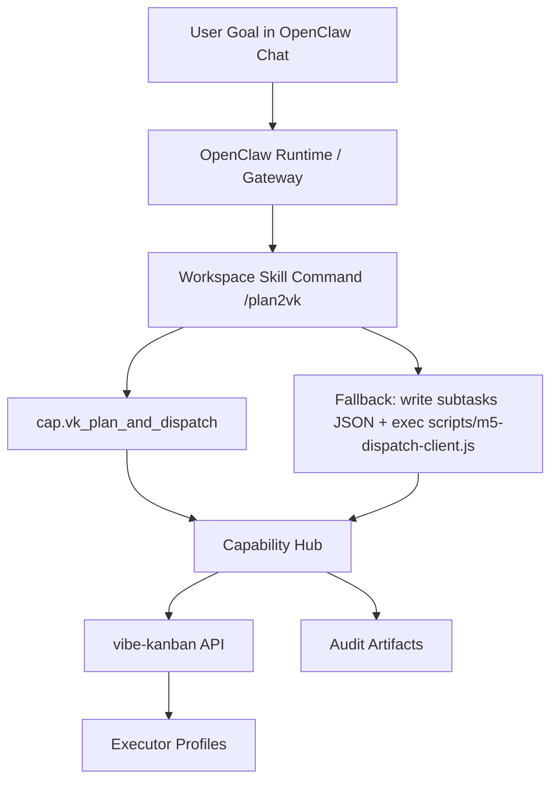

# Product Architecture Deep Dive: OpenClaw + Capability Hub + vibe-kanban

This document describes the **current verified system only**. It is an engineering deep dive for the local OpenClaw + Capability Hub + vibe-kanban integration that is implemented and evidenced in this repository. It is **not** a product roadmap, plugin-command proposal, or speculative future design.

`README.md` remains the operator runbook. This document explains the architectural rationale, system model, interfaces, dispatch semantics, reliability boundaries, and verification evidence behind that runbook.

## 1. Problem Definition and Design Objectives

### 1.1 Problem statement

The product problem can be stated as follows:

> Transform a natural-language user goal into an executable, auditable, multi-agent work graph that can be routed into concrete vibe-kanban tasks with bounded failure domains and operator-visible evidence.

The current verified system solves this problem through a layered orchestration path:

1. A user submits a goal in OpenClaw chat.
2. The workspace skill command `/plan2vk <goal>` interprets the request as a reverse-dispatch workflow.
3. The system chooses a dispatch path:
   - **Primary tool path**: direct call to `cap.vk_plan_and_dispatch`
   - **Fallback exec path**: write subtasks JSON, then execute `scripts/m5-dispatch-client.js`
4. Capability Hub materializes the plan into vibe-kanban tasks.
5. vibe-kanban routes the tasks to executor profiles such as `CODEX` or `CLAUDE_CODE`.

### 1.2 Design objectives

The verified design optimizes for the following engineering objectives:

- **Deterministic dispatch boundary**: there is a clear handoff point between goal decomposition and task materialization
- **Low operator overhead**: the user should be able to operate the system from OpenClaw chat or from a thin CLI fallback
- **Auditability**: dispatch results are captured in verification reports, dispatch logs, and dispatch state files
- **Bounded failure domains**: tool visibility failure, gateway failure, fallback failure, and task-creation failure are separated
- **Recoverability**: idempotency state, logs, and explicit links help reconcile partial success
- **Minimal coupling**: OpenClaw, Capability Hub, and vibe-kanban remain distinct runtime layers

### 1.3 Plane decomposition

The current system is easier to reason about when split into three planes:

- **Control plane**: components that decide what should happen next
  - OpenClaw runtime
  - workspace skill command `/plan2vk`
  - Capability Hub dispatch orchestration
- **Data plane**: the structured payloads and state exchanged between components
  - goal text
  - subtask arrays
  - MCP tool payloads
  - dispatch state/log JSON artifacts
- **Execution plane**: the place where work is materially scheduled and executed
  - vibe-kanban tasks
  - executor profiles
  - task attempts and workspaces

In short:

\[
\text{User Intent} \rightarrow \text{Control Decisions} \rightarrow \text{Structured Dispatch Payloads} \rightarrow \text{Executable Tasks}
\]

## 2. System Topology and Component Responsibilities

### 2.1 High-level topology



### 2.2 Responsibilities by component

#### OpenClaw runtime and gateway

OpenClaw is the user-facing conversational runtime. In the current verified system it is responsible for:

- receiving the user message
- resolving the workspace skill command `/plan2vk`
- exposing the available runtime tool list
- executing either the direct tool path or the fallback exec path

OpenClaw is **not** the task backend. It does not own task persistence or executor routing.

#### Workspace skill command `/plan2vk`

`/plan2vk` is a **workspace skill command**, not merely an `AGENTS.md` prompt convention. In the current verified design it is the chat-facing orchestration entrypoint.

Its role is to:

- interpret the goal text
- decompose the goal into subtasks
- prefer the direct tool path when `cap.vk_plan_and_dispatch` is available
- fall back to `write + exec -> scripts/m5-dispatch-client.js` when the runtime tool list does not expose the dispatch tool

#### Capability Hub

Capability Hub is the MCP bridge/adapter between OpenClaw and vibe-kanban. It is responsible for:

- exposing `cap.*` tools over stdio MCP
- validating the dispatch payload shape
- translating the dispatch request into vibe-kanban task creation calls
- writing dispatch state and audit logs

Capability Hub is **not** the chat runtime and **not** the executor itself.

#### vibe-kanban

vibe-kanban is the execution backend. It is responsible for:

- storing the parent task and child tasks
- exposing the dashboard and API
- routing tasks to executor profiles
- maintaining task attempts and workspace associations

### 2.3 Primary vs fallback path

The current system intentionally separates two execution paths:

#### Primary tool path

\[
/plan2vk \rightarrow cap.vk\_plan\_and\_dispatch \rightarrow \text{Capability Hub} \rightarrow \text{vibe-kanban}
\]

This is the preferred path because it removes one extra wrapper layer.

#### Fallback exec path

\[
/plan2vk \rightarrow \text{write subtasks JSON} \rightarrow \texttt{scripts/m5-dispatch-client.js} \rightarrow \text{Capability Hub} \rightarrow \text{vibe-kanban}
\]

This path exists to preserve usability even when the runtime tool surface does not expose `cap.vk_plan_and_dispatch`.

## 3. Formal System Model

### 3.1 Notation

Let:

- \(g\) = user goal
- \(D(g) = \{s_1, s_2, \dots, s_n\}\) = decomposition of the goal into subtasks
- \(n = |D(g)|\) = number of subtasks
- \(R(s_i) \rightarrow e_i\) = routing function from subtask text to executor profile
- \(\Phi(g) \rightarrow (p, S, a)\) = dispatch operator producing:
  - \(p\): parent task
  - \(S = \{t_1, \dots, t_n\}\): created subtasks
  - \(a\): optional assist task

In the current policy:

\[
1 \le n \le 10
\]

because `capability-hub/config/m5-dispatch-policy.json` sets:

- `subtask_limits.min = 1`
- `subtask_limits.max = 10`

### 3.2 Analytical objective

The current implementation does not solve a formal optimization problem, but its design objective can be modeled as:

\[
\max M = \mathbf{1}[p\ created] + \sum_{i=1}^{n}\mathbf{1}[t_i\ created] + \mathbf{1}[a\ created]
\]

subject to:

- tool visibility constraints
- project/repository binding constraints
- timeout budget constraints
- idempotency constraints
- API reachability constraints

This objective is analytical rather than algorithmically explicit. It describes what the architecture tries to maximize: successful task materialization under practical runtime constraints.

### 3.3 Latency model

The end-to-end latency of the reverse-dispatch flow can be approximated by:

\[
T_{total} = T_{skill} + T_{mcp} + T_{parent} + \sum_{i=1}^{n} T_{subtask_i} + T_{assist} + T_{persist}
\]

where:

- \(T_{skill}\) is the OpenClaw skill-side reasoning and decomposition time
- \(T_{mcp}\) is the MCP request/response overhead
- \(T_{parent}\) is parent task creation time
- \(T_{subtask_i}\) is each child-task creation time
- \(T_{assist}\) is optional assist-task creation time
- \(T_{persist}\) is final state/log persistence time

Because the current dispatch implementation creates subtasks sequentially, the dispatch portion is approximately:

\[
T_{dispatch} \approx T_{parent} + n \cdot \mathbb{E}[T_{create}] + T_{assist} + T_{overhead}
\]

This means the latency grows approximately linearly with the number of subtasks.

### 3.4 Timeout safety condition

For the fallback client to observe a completed result instead of a timeout, the request budget must satisfy:

\[
\tau_{client} > T_{total} + \varepsilon
\]

where:

- \(\tau_{client}\) is the fallback client timeout budget
- \(\varepsilon\) is safety slack for scheduling, process startup, and serialization overhead

The previous failure mode can be expressed as:

\[
\tau_{client} = 60000\text{ ms}, \quad T_{total} > 60000\text{ ms}
\]

which implies:

\[
\tau_{client} < T_{total}
\Rightarrow \text{caller observes timeout}
\]

The current fallback timeout contract sets:

\[
\tau_{client} = 300000\text{ ms}
\]

in `scripts/m5-dispatch-client.js`, which restores a safer operating margin for larger fallback dispatches.

### 3.5 Reliability factorization

The following expressions are best understood as structural reliability decompositions, not measured production probabilities:

\[
P_{success,fallback} = P_{skill} \cdot P_{exec} \cdot P_{mcp} \cdot P_{dispatch}
\]

\[
P_{success,overall} = 1 - (1 - P_{primary})(1 - P_{fallback})
\]

These equations explain the architectural benefit of having both a primary tool path and a fallback exec path: the overall system can remain operational even if one path is temporarily unavailable.

## 4. Dispatch and Routing Semantics

### 4.1 Routing model

The routing policy is a rule-based classifier over subtask text:

\[
e_i = R(s_i, \Pi, e_{default})
\]

where:

- \(\Pi\) is the ordered set of routing rules from `m5-dispatch-policy.json`
- \(e_{default}\) is `vk-bindings.defaultExecutorProfileId`

Operationally:

1. Each subtask title and description are concatenated
2. The policy rules are evaluated in order
3. The first matching rule chooses the executor
4. If no rule matches, the default executor is used

The current design therefore uses **rule-based routing**, not embedding-based semantic classification and not model-side probabilistic assignment.

### 4.2 Dispatch order

The current dispatch algorithm in `capability-hub/src/vk-client.js` executes in the following order:

1. Validate project repositories
2. Create the parent task
3. Poll up to five times for `parent_workspace_id`
4. Create subtasks sequentially
5. Optionally create the assist task
6. Build dashboard links
7. Persist final result into:
   - `m5-dispatch-state.json`
   - `m5-dispatch-log.jsonl`

This order matters because it defines both latency and failure semantics.

### 4.3 Idempotency semantics

Dispatch idempotency is cache-based:

- the effective key is chosen from `idempotency_key`, `meta.trace_id`, or the generated `traceId`
- if a non-expired cached record exists, the dispatcher returns that prior result instead of recreating tasks

Formally, if \(k\) is the resolved idempotency key and \(C(k)\) is the cached result:

\[
C(k) \neq \varnothing \Rightarrow \Phi(g, k) = C(k)
\]

This suppresses duplicate task creation within the cache TTL window.

### 4.4 Assist-task semantics

The current policy enables an optional assist task:

- `assist.enabled = true`
- `assist.executor = CODEX`

The assist task is conceptually distinct from the primary subtask set. It is a planning-support companion task rather than one of the decomposed work items.

## 5. Interface Contracts

### 5.1 User-visible entrypoint

The current chat entrypoint is:

```text
/plan2vk <goal>
```

This command is resolved as a **workspace skill command** in the OpenClaw runtime.

### 5.2 Internal tool contract

Capability Hub registers the following tool:

```text
cap.vk_plan_and_dispatch(
  meta,
  goal,
  subtasks,
  project_id?,
  repo_ids?,
  target_branch?,
  assist_planning?,
  idempotency_key?
)
```

The current input fields are:

| Field | Meaning |
|------|---------|
| `meta` | tracing/session metadata |
| `goal` | original user goal text |
| `subtasks` | array of `{ title, description? }` |
| `project_id?` | explicit vibe-kanban project override |
| `repo_ids?` | repository binding override |
| `target_branch?` | branch override |
| `assist_planning?` | enable or disable assist task creation |
| `idempotency_key?` | explicit cache key |

The current output fields are:

| Field | Meaning |
|------|---------|
| `ok` | whether at least one subtask was created |
| `trace_id` | trace identifier |
| `hub_contract_version` | Capability Hub contract version |
| `dispatch_id` | dispatch instance identifier |
| `project_id` | resolved project id |
| `parent_task_id` | created parent task id |
| `parent_workspace_id` | resolved parent workspace id if available |
| `subtasks_created` | array of created task ids with executors and titles |
| `assist_task_id` | assist-task id if created |
| `warnings` | non-fatal conditions |
| `errors` | structured stage-specific failures |
| `links` | dashboard links for created tasks |

### 5.3 Fallback CLI contract

The fallback CLI contract is:

```text
scripts/m5-dispatch-client.js --mode dispatch --goal ... --subtasks-file ... [--timeout-ms ...]
```

Important current semantics:

- default timeout: `300000` ms
- minimum accepted timeout: `1000` ms
- environment override: `M5_DISPATCH_TIMEOUT_MS`

The fallback client does not perform the dispatch itself. It is a thin MCP client that invokes `cap.vk_plan_and_dispatch` through a stdio transport.

### 5.4 Behavioral success criteria

At the behavior level, a successful dispatch means:

1. the tool request or fallback invocation reaches Capability Hub
2. vibe-kanban accepts the parent task
3. one or more subtasks are created
4. the result payload includes task ids and links
5. the final state/log artifacts record the dispatch

## 6. Failure Domains and Recovery Logic

### 6.1 Failure domains

The current verified system has at least five distinct failure domains:

1. **Tool invisibility**
   - `cap.vk_plan_and_dispatch` is not exposed in the runtime tool list
2. **Gateway auth or connectivity failure**
   - OpenClaw gateway is unreachable or token-auth is mismatched
3. **MCP request timeout**
   - caller-side timeout expires before the dispatch completes
4. **Best-effort workspace linkage lag**
   - parent task exists but `parent_workspace_id` is not yet available
5. **Routing or backend task-creation failure**
   - routing rules or vibe-kanban API calls fail for some or all subtasks

### 6.2 Partial-success model

Partial success arises because task creation and caller observation are not the same event.

Let \(k\) be the number of backend task-creation calls that succeeded before the caller timed out. Then:

\[
0 < k \le n
\]

can hold even when the caller receives a timeout error.

More precisely, if:

\[
t_k < \tau_{client} < T_{persist}
\]

then backend task creation for the first \(k\) tasks may already be durable even though the caller observes failure before final result persistence completes.

This is exactly why the timeout problem was operationally confusing: vibe-kanban could already contain the work while the caller still reported `MCP error -32001: Request timed out`.

### 6.3 Current mitigations

The current verified system mitigates these failure modes through:

- **tool-first strategy**: prefer the primary tool path when the tool is visible
- **fallback exec path**: preserve operability when the tool is not visible
- **extended fallback MCP timeout**: default `300000` ms instead of the MCP SDK default `60000` ms
- **state/log persistence**: record dispatch results in `m5-dispatch-state.json` and `m5-dispatch-log.jsonl`
- **idempotency cache**: reduce duplicate materialization risk
- **warning-bearing result contract**: separate fatal errors from non-fatal conditions like delayed workspace lookup

## 7. Verification Model

### 7.1 Verification layers

The current system uses three distinct verification perspectives:

#### Tool-path verification

This verifies the direct dispatch path:

\[
cap.vk\_plan\_and\_dispatch \rightarrow \text{Capability Hub} \rightarrow \text{vibe-kanban}
\]

Evidence:

- `capability-hub/evidence/m5-tool-verification.json`

Current verified properties include:

- `decision_path = tool_direct`
- `dispatch_tool_registered = true`
- `tasks_created = 2`
- `attempts_observed = 1`
- `overall_ok = true`

#### Chat-path verification

This verifies the end-to-end OpenClaw chat path:

\[
/plan2vk \rightarrow \text{workspace skill command} \rightarrow \text{dispatch path} \rightarrow \text{vibe-kanban}
\]

Evidence:

- `capability-hub/evidence/m5-chat-verification.json`

Current verified properties include:

- `decision_path = openclaw_skill_command`
- `skill_exists = true`
- `skill_listed = true`
- `skill_dispatch_found = true`
- `skill_exec_fallback_found = true`
- `contract_mode = fallback_note`
- `tasks_created = 1`
- `attempts_observed = 1`
- `overall_ok = true`

#### Operator runbook verification

This verifies that the runbook, scripts, and runtime configuration are aligned enough for an operator to reproduce the flow. The runbook itself is in `README.md`, while the capability-specific runbook is in `capability-hub/README.md`.

### 7.2 Timeout-fix validation

The public repository keeps a sanitized selected evidence file for the fallback-timeout hardening:

- `capability-hub/evidence/m5-timeout-hardening.json` records:
  - the shipped fallback timeout contract of `300000` ms
  - the old MCP SDK boundary of `60000` ms
  - a selected large-batch fallback success case with `subtasks_created = 10`

This is sufficient to support the retained public acceptance statement:

> The fallback timeout contract is hardened beyond the old 60-second SDK default, and the public evidence bundle includes a selected large-batch success case captured after that hardening change.

### 7.3 Verified acceptance statements

Based on the repository artifacts, the following statements are currently justified:

- The tool path is verified.
- The chat path is verified.
- `/plan2vk` is implemented as a workspace skill command.
- The fallback exec path exists and is documented.
- The fallback timeout contract has been hardened beyond the old 60-second SDK default, and the public evidence bundle retains a selected large-batch success case after that change.

## 8. Current Limits and Non-Goals

This document intentionally excludes non-implemented or non-verified future work.

### 8.1 Current limits

- Routing is rule-based and string-driven, not semantic or learned.
- Child-task creation is sequential, so latency increases roughly linearly with subtask count.
- Parent workspace linkage is best-effort and may lag behind parent-task creation.
- The fallback path still depends on the availability of local execution and MCP transport startup.
- The current design assumes the goal has already been decomposed before `cap.vk_plan_and_dispatch` is called.

### 8.2 Non-goals

The following are **not** part of the current verified system described here:

- a native OpenClaw plugin command implementation for `/plan2vk`
- a new raw-goal-to-subtasks adapter inside Capability Hub
- predictive scheduling, queue-theoretic optimization, or semantic planner scoring
- any product claim beyond the currently verified local integration stack

## 9. Practical Reading Guide

Use the documents in this order depending on your task:

1. `README.md` — how to run and operate the stack
2. `capability-hub/README.md` — module-level runbook and M5 verification workflow
3. `PRODUCT_ARCHITECTURE_DEEP_DIVE.md` — why the architecture is shaped this way and how the current verified system behaves mathematically and operationally

That separation is intentional:

- `README.md` answers **how to use it**
- this document answers **why it works this way**
